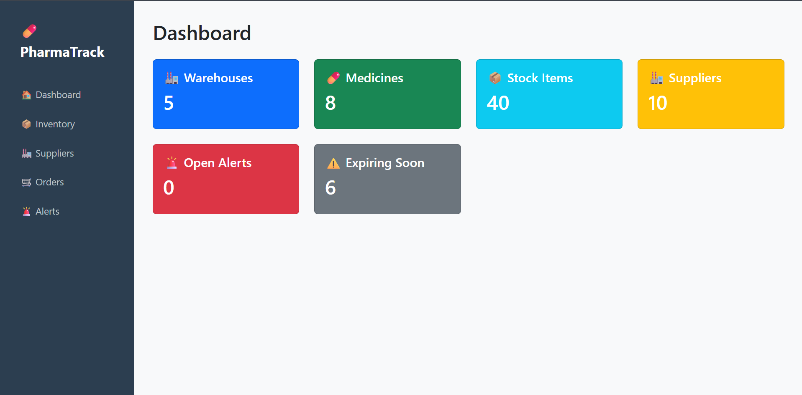
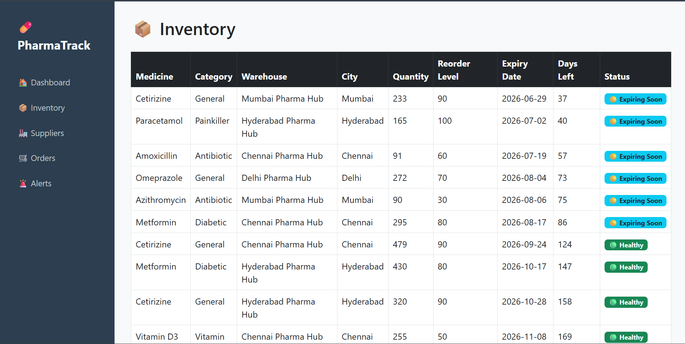
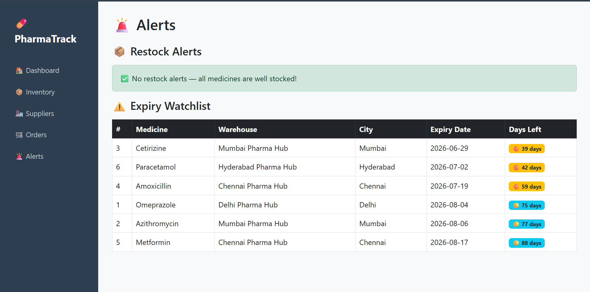

# 💊 PharmaTrack

Real-Time Pharmacy Inventory & Supply Chain Management System built with Flask + MySQL.

## 🚀 Features

- Inventory tracking across 5 warehouse locations
- Supplier and purchase order management
- Automated restock alerts using MySQL triggers
- Expiry date watchlist with automatic flagging
- Real-time stock movement logging
- Color-coded stock status dashboard

## 🛠️ Tech Stack

- **Backend:** Python, Flask
- **Database:** MySQL
- **Frontend:** HTML, Bootstrap 5
- **Data Generation:** Faker

## 🗄️ Database Design

- 8 related MySQL tables
- 4 automated triggers
- Foreign key relationships
- Generated columns

## ⚡ MySQL Triggers

| Trigger | Event | Action |
|---------|-------|--------|
| trg_low_stock_alert | AFTER UPDATE on inventory | Creates restock alert when stock drops below reorder level |
| trg_log_stock_movement | AFTER UPDATE on inventory | Logs every stock IN/OUT movement automatically |
| trg_expiry_flag | AFTER INSERT on inventory | Flags medicines expiring within 90 days |
| resolve_alert_on_order | AFTER INSERT on purchase_orders | Updates alert status to Ordered when PO placed |

## 📸 Screenshots

### Dashboard

### Inventory

### Alerts

## ⚙️ Setup Instructions

1. Clone the repository
   git clone https://github.com/Yash250204/pharmatrack.git

2. Install dependencies
   pip install -r requirements.txt

3. Create config.py in root folder with your MySQL credentials
   DB_CONFIG = {
       "host": "localhost",
       "user": "root",
       "password": "YOUR_PASSWORD",
       "database": "pharmatrack"
   }

4. Run schema in MySQL Workbench
   Open db/schema.sql and execute it

5. Run triggers in MySQL Workbench
   Open db/triggers.sql and execute it

6. Seed the database
   python db/seed.py

7. Run the app
   python app.py

8. Open browser
   http://localhost:5000